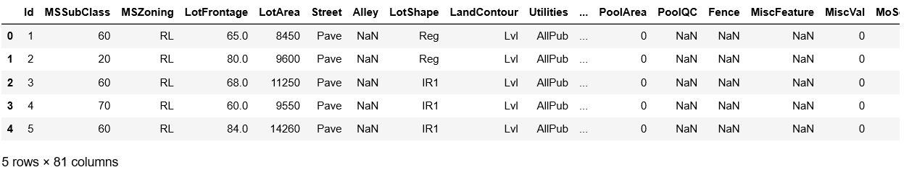
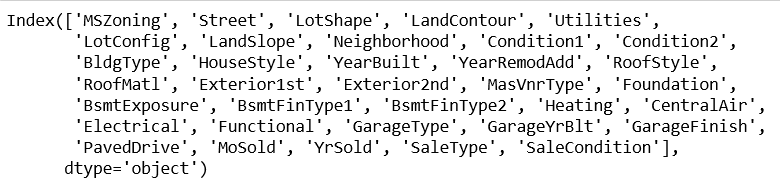
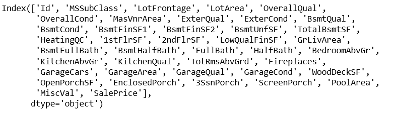
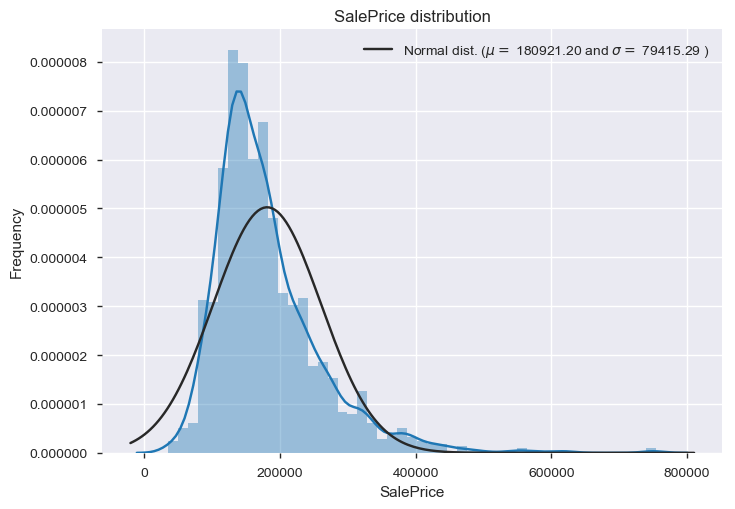
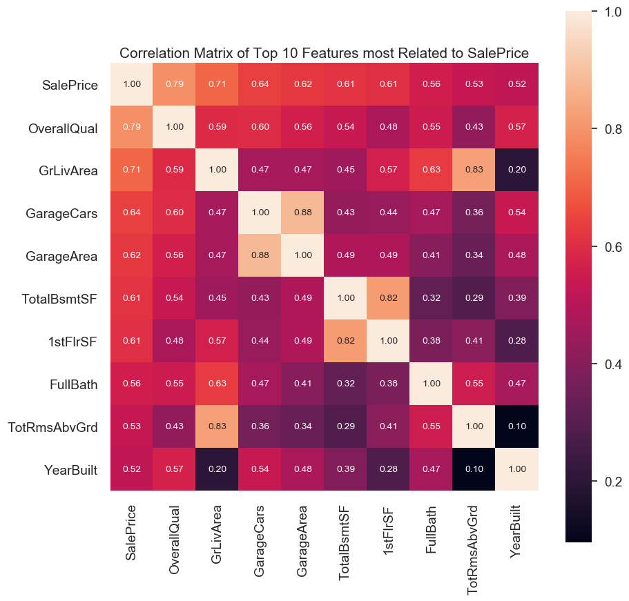
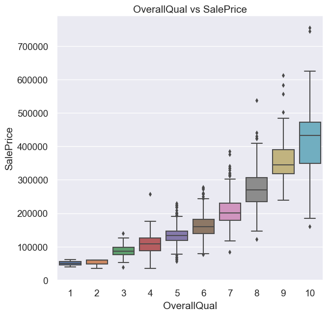
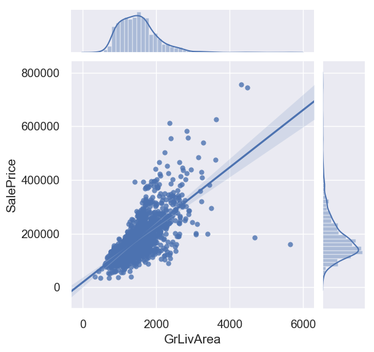
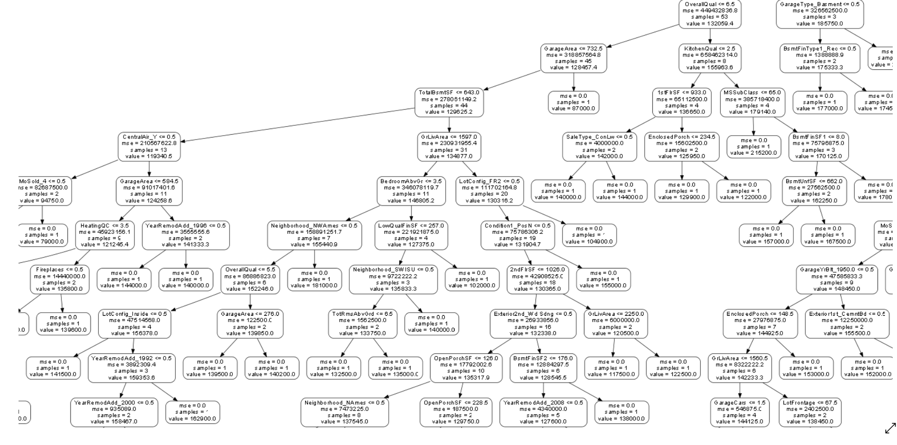
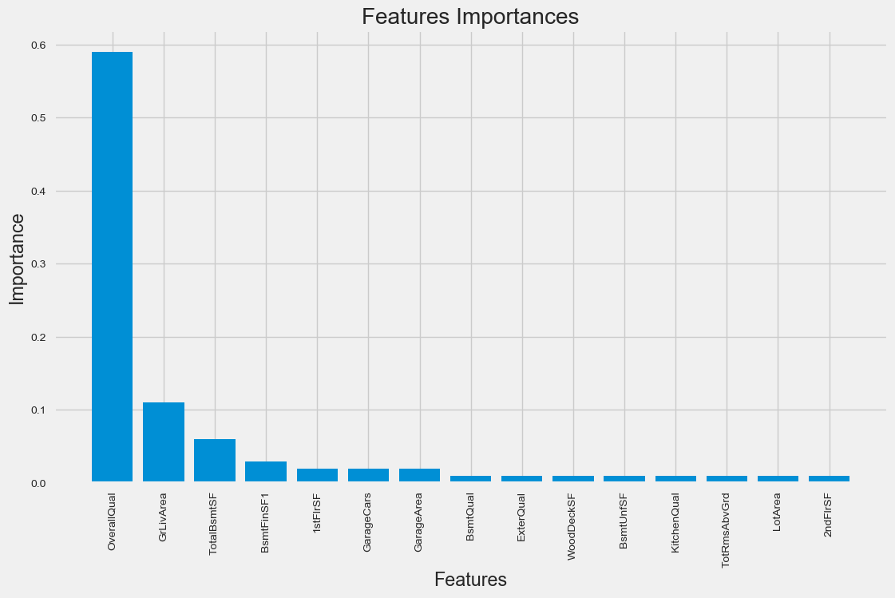
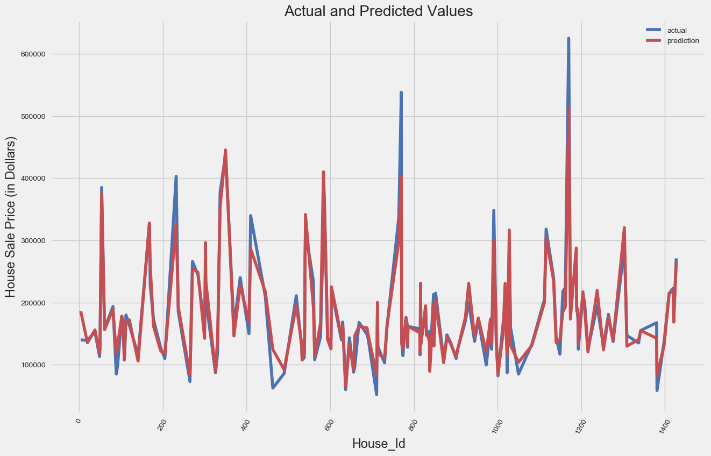

# House_SalePrice_Prediction

## INTRODUCTION
Our goal for this project is to use __Machine Learning Regression Technique__ in order to estimate the __SalePrice__ (in dollars) for a particular House as a __function__ of __81 explanatory variables__ describing (almost) every aspect of a House. 
  - We want to find a function that given input data for these 81 explanatory variables __predicts the SalePrice of a House__.
  - Which feature __contribute__ to *SalePrice*?
  - Visualize the __relationship__ between the _features_ and the _response_.
  
## DATA
The dataset comprises of __1460 observations of 81 columns__. Below is a table showing names of all the columns and their description.
  
| Column Name | Description |
| --- | --- |
| Id | House Id |
| MSSubClass | The building class |
| MSZoning | The general zoning classification |
| LotFrontage | Linear feet of street connected to property |
| LotArea | Lot size in square feet |
| Street | Type of road access |
| Alley | Type of alley access |
| LotShape | General shape of property |
| LandContour | Flatness of the property |
| Utilities | Type of utilities available |
| LotConfig | Lot configuration |
| LandSlope | Slope of property |
| Neighborhood | Physical locations within Ames city limits |
| Condition1 | Proximity to main road or railroad |
| Condition2 | Proximity to main road or railroad (if a second is present) |
| BldgType | Type of dwelling |
| HouseStyle | Style of dwelling |
| OverallQual | Overall material and finish quality |
| OverallCond | Overall condition rating |
| YearBuilt | Original construction date |
| YearRemodAdd | Remodel date |
| RoofStyle | Type of roof |
| RoofMatl | Roof material |
| Exterior1st | Exterior covering on house |
| Exterior2nd | Exterior covering on house (if more than one material) |
| MasVnrType | Masonry veneer type |
| MasVnrArea | Masonry veneer area in square feet |
| ExterQual | Exterior material quality |
| ExterCond | Present condition of the material on the exterior |
| Foundation | Type of foundation |
| BsmtQual | Height of the basement |
| BsmtCond | General condition of the basement |
| BsmtExposure | Walkout or garden level basement walls |
| BsmtFinType1 | Quality of basement finished area |
| BsmtFinSF1 | Type 1 finished square feet |
| BsmtFinType2 | Quality of second finished area (if present) |
| BsmtFinSF2 | Type 2 finished square feet |
| BsmtUnfSF | Unfinished square feet of basement area |
| TotalBsmtSF | Total square feet of basement area |
| Heating | Type of heating |
| HeatingQC | Heating quality and condition |
| CentralAir | Central air conditioning |
| Electrical | Electrical system |
| 1stFlrSF | First Floor square feet |
| 2ndFlrSF | Second floor square feet |
| LowQualFinSF | Low quality finished square feet (all floors) |
| GrLivArea | Above grade (ground) living area square feet |
| BsmtFullBath | Basement full bathrooms |
| BsmtHalfBath | Basement half bathrooms |
| FullBath | Full bathrooms above grade |
| HalfBath | Half baths above grade |
| Bedroom | Number of bedrooms above basement level |
| Kitchen | Number of kitchens |
| KitchenQual | Kitchen quality |
| TotRmsAbvGrd | Total rooms above grade (does not include bathrooms) |
| Functional | Home functionality rating |
| Fireplaces | Number of fireplaces |
| FireplaceQu | Fireplace quality |
| GarageType | Garage location |
| GarageYrBlt | Year garage was built |
| GarageFinish | Interior finish of the garage |
| GarageCars | Size of garage in car capacity |
| GarageArea | Size of garage in square feet |
| GarageQual | Garage quality |
| GarageCond | Garage condition |
| PavedDrive | Paved driveway |
| WoodDeckSF | Wood deck area in square feet |
| OpenPorchSF | Open porch area in square feet |
| EnclosedPorch | Enclosed porch area in square feet |
| 3SsnPorch | Three season porch area in square feet |
| ScreenPorch | Screen porch area in square feet |
| PoolArea | Pool area in square feet |
| PoolQC | Pool quality |
| Fence | Fence quality |
| MiscFeature | Miscellaneous feature not covered in other categories |
| MiscVal | $Value of miscellaneous feature |
| MoSold | Month Sold |
| YrSold | Year Sold |
| SaleType | Type of sale |
| SaleCondition | Condition of sale |
| __SalePrice__ | __Property's Sale Price in dollars__ __(*This is the target variable that we are trying to predict*)__ |

__List of Categorical Features:__

__List of Numerical Features:__

## EXPLORATORY DATA ANALYSIS
| Description | Observation |
| --- | --- |
| SalePrice Distribution |  |
| Top 10 Features Correlated with SalePrice |  |
| OverallQual vs SalePrice |  |
| GrLivArea vs SalePrice |  |

## RANDOM FOREST REGRESSION
| Description | Observation |
| --- | --- |
| Visualizing a Single Decision Tree from Random Forest |  |
| Features Importance |  |
| Visualizing Actual and Predicted Values |  |

- [Jupyter Notebook](./HousePricePrediction.ipynb)
- [House Sale Price Prediction Presentation](./HOUSE_SALEPRICE_PREDICTION.pptx)
- [House Sale Price Prediction Video Presentation](./HouseSalePricePrediction-Video.mp4)
