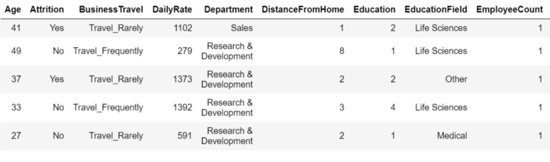
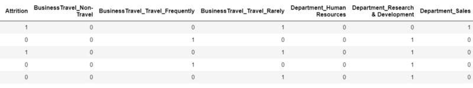
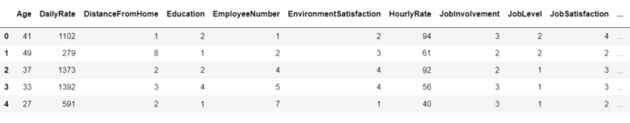

# INSAID
INSAID Projects

## INTRODUCTION
Every year a lot of companies hire a number of employees. The companies __invest__ time and money in __training__ those employees, not just this but there are __training programs__ within the companies for their existing employees as well. The __aim__ of these programs is to __increase the effectiveness__ of their employees. 
- But where __HR Analytics__ fit in this? 
- and is it just about __improving__ the performance of employees?

## DATA
| Column Name | Description |
| --- | --- |
| `AGE` | Numerical Value |
| `ATTRITION` | Employee leaving the Company (0=no, 1=yes) |
| `BUSINESS TRAVEL`| (1= No Travel, 2= Travel Frequency, 3= Travel rarely)|
| `JOB ROLE` | (1=HC REP, 2=HR, 3=LAB TECHNICIAN, 4=MANAGER, 5= MANAGING DIRECTOR, 6= REASEARCH DIRECTOR, 7= RESEARCH SCIENTIST, 8=SALES EXECUTIEVE, 9= SALES REPRESENTATIVE) |
| `MARITAL STATUS` | (1=DIVORCED, 2=MARRIED, 3=SINGLE) |
| `GENDER` | (1=FEMALE, 2=MALE) |
| `OVER 18` | 1=YES, 2=NO) |
| `OVERTIME` | (1=NO, 2=YES) |
| `EDUCATION FIELD` | (1=HR, 2=LIFE SCIENCES, 3=MARKETING, 4=MEDICAL SCIENCES, 5=OTHERS, 6= TEHCNICAL) |
| `DEPARTMENT` | (1=HR, 2=R&D, 3=Sales) |

## PROJECT ANALYSIS
| Description | Analysis |
| --- | --- |
| hr_data.head |  |
| dummies |  |
| final |  |

### FEATURE IMPORTANCE

- We saw how we can avoid using correlated values and why it is important not to use those while modelling. 
- We used Random forest and learned how it can be very advantageous over other available machine learning algorithm. 
- Most of all we found factors which are most important to employees and if are not fulfilled might lead to Attrition.
